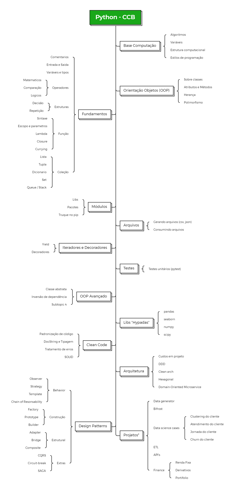

# CCB-PYTHON
Python fundamentals course

# Summary

| Macro  | Micro | Class  | Script |Exercise |Status |
| ------------- | ------------- |-------------  | ------------- |------------- | ------------- |
|Base computer|topic|:link:|:heavy_check_mark:|:x:|:x:|
|Fundamentals|input and output|:link:|:heavy_check_mark:|:x:|:x:|
|Fundamentals|Type variables|:link:|:heavy_check_mark:|:x:|:x:|
|Fundamentals|Operators|:link:|:heavy_check_mark:|:x:|:x:|
|Fundamentals|Decision Struct|:link:|:heavy_check_mark:|:x:|:x:|
|Fundamentals|Loop Struct|:link:|:heavy_check_mark:|:x:|:x:|
|Fundamentals|Function|:link:|:heavy_check_mark:|:x:|:x:|
|Fundamentals|Collections|:link:|:heavy_check_mark:|:x:|:x:|
|OOP|Syntax|:link:|:heavy_check_mark:|:x:|:x:|
|OOP|Attributes and Methods|:link:|:heavy_check_mark:|:x:|:x:|
|OOP|Inheritance|:link:|:heavy_check_mark:|:x:|:x:|
|OOP|Polymorphism|:link:|:heavy_check_mark:|:x:|:x:|
|OOP|Magic Methods|:link:|:heavy_check_mark:|:x:|:x:|
|OOP|Data Class|:link:|:heavy_check_mark:|:x:|:x:|
|Packages|topic|:link:|:x:|:x:|:x:|
|Iterator|Generator|:link:|:heavy_check_mark:|:x:|:x:|
|Iterator|Yield|:link:|:heavy_check_mark:|:x:|:x:|
|Decorator|Decorator|:link:|:heavy_check_mark:|:x:|:x:|
|Files|topic|:link:|:x:|:x:|:x:|
|Advanced OOP|topic|:link:|:x:|:x:|:x:|
|Clean code|topic|:link:|:x:|:x:|:x:|
|Architecture|topic|:link:|:x:|:x:|:x:|
|Design Patterns|topic|:link:|:x:|:x:|:x:|
|Hype Libs|topic|:link:|:x:|:x:|:x:|
|Tests|topic|:link:|:x:|:x:|:x:|
|Project|topic|:link:|:x:|:x:|:x:|

# Roadmap

